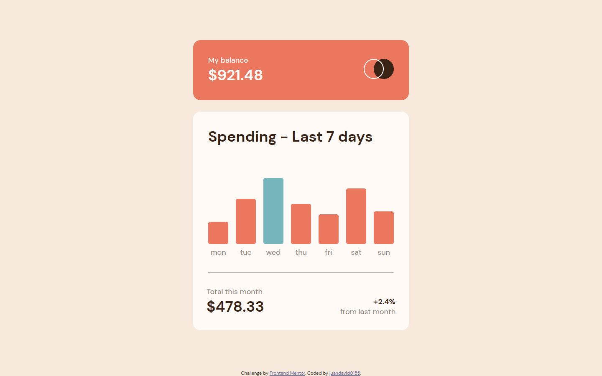

# Frontend Mentor - Expenses chart component solution

*Note*: my native language is spanish. English is in process. Apologies for gramatical faults

This is a solution to the [Expenses chart component challenge on Frontend Mentor](https://www.frontendmentor.io/challenges/expenses-chart-component-e7yJBUdjwt). Frontend Mentor challenges help you improve your coding skills by building realistic projects. 

## Table of contents

- [Overview](#overview)
  - [The challenge](#the-challenge)
  - [Screenshot](#screenshot)
  - [Links](#links)
- [My process](#my-process)
  - [Built with](#built-with)
  - [What I learned](#what-i-learned)
  - [Continued development](#continued-development)
  - [Useful resources](#useful-resources)
- [Author](#author)

## Overview

### The challenge

Users should be able to:

- View the bar chart and hover over the individual bars to see the correct amounts for each day
- See the current day’s bar highlighted in a different colour to the other bars
- View the optimal layout for the content depending on their device’s screen size
- See hover states for all interactive elements on the page
- **Bonus**: Use the JSON data file provided to dynamically size the bars on the chart

### Screenshot




### Links

- Solution URL: [Add solution URL here](https://your-solution-url.com)
- Live Site URL: [Add live site URL here](https://your-live-site-url.com)

## My process

### Built with

- HTML
- Javascript
- CSS
- Flexbox 

### What I learned


First of all, it's important to have a predifined structure about what you're going to do, define the structure. In this case, i started to just going and doing, without a previous vision of "how" to get the
design. The img of the design is there, but... ¿how?. 

So on, i realized tha my code was getting redundant, and probably stills, but so much than now, and the solution was to think of the values, mainly for the padding and the margin, and then how it will works with a general set up of the properties with the body.

```css
@media (max-width: 375px) {
    body , main{
        font-size: 12px;
    }
    .chars-header h2, span {
        margin-top: 0;
    }
    .bar {
        width: 2rem;
    }
}
```
It cost me a lot to understand what simple could be to get the mobile version with just play with the
font-size, and try to think a general structure for the margin and padding to acomplish it.

Even now, i'm not sure, one hundred percent, if i did get the responsive in a properly way, but for sure is better than the first version. With repetitive code and changin the padding and margin values in many different divs.

Also, i take with me, to think more aboute the sizes. A constant problem that i had, was to get the bars into
its container and prevent it to don't get overlapping. For that, i realized (with previos research), that when defining the size of the bars, when the container stretch enough to the item dont fit in, it gets out of the container. So, the solution was to solve the child can also stretch (with min-width propertie.)and get resized once it doesn't fit.


### Continued development

Continuing with what i've learned, definitely i'll researh for how flexbox works and reinforce the knowledge from it. In a firts way, some topics related to it, seems pretty simple, but the results were unexpected.
So rigth know i'm kinda far for its understanding, but hope, soon changes.

### Useful resources

- [flexbox-solution for overlapping](https://css-tricks.com/flexbox-truncated-text/) - Related to the previous topic, this helped me for get a responsive desing using flexbox. The "min-witdth: 0" on the child for a flex container
makes the width defined for the item to not overlapping from the parent's width. This was very useful to know.


## Author

- Website - [Add your name here](https://www.your-site.com)
- Frontend Mentor - [@yourusername](https://www.frontendmentor.io/profile/yourusername)
- Twitter - [@yourusername](https://www.twitter.com/yourusername)

**Note: Delete this note and add/remove/edit lines above based on what links you'd like to share.**

## Acknowledgments

This is where you can give a hat tip to anyone who helped you out on this project. Perhaps you worked in a team or got some inspiration from someone else's solution. This is the perfect place to give them some credit.

**Note: Delete this note and edit this section's content as necessary. If you completed this challenge by yourself, feel free to delete this section entirely.**
